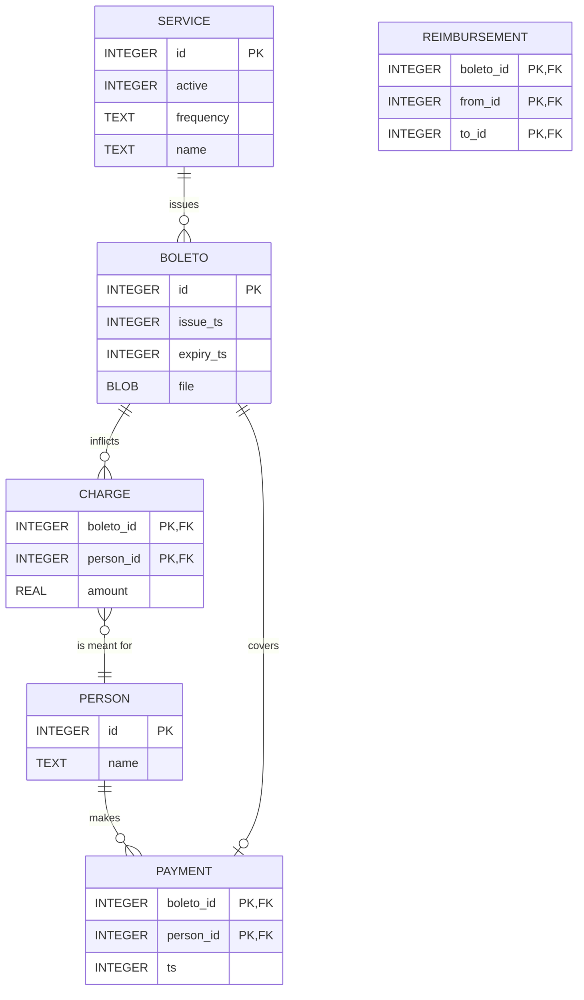

# Boleto Manager using Flask

"Boleto" is a common billing system used in Brazil.
This project aims to organize boletos and their payments.

## Entity-relationship model

Attributes are typed as `sqlite3` storage classes.

