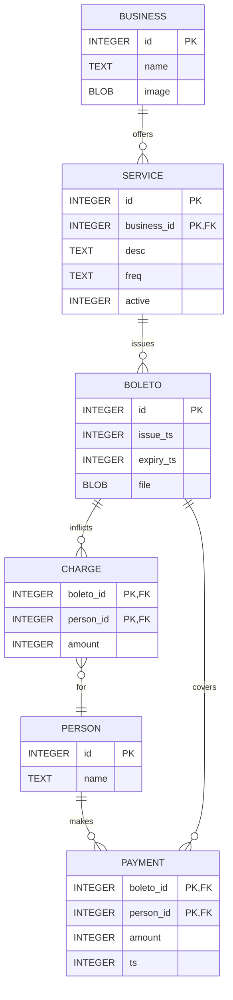

# Boleto Manager using Flask

"Boleto" is a common billing system used in Brazil.
This project aims to organize boletos and their payments.

## Setup

```sh
python -m venv .venv
source .venv/bin/activate
pip install -r requirements.txt
```

## Entity-relationship model

Attributes are typed as `sqlite3` storage classes.


